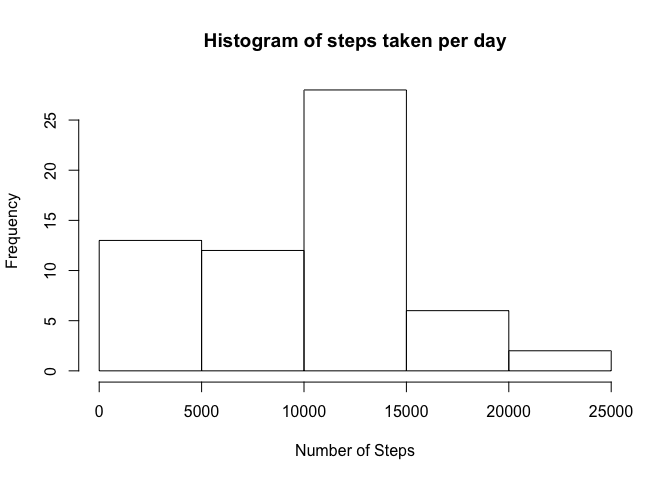
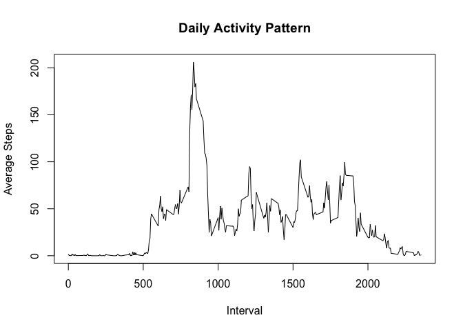
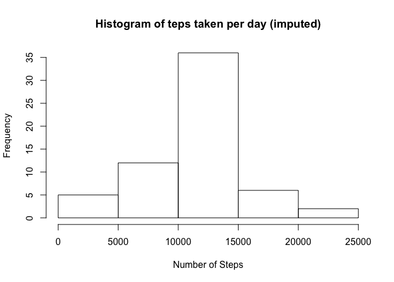
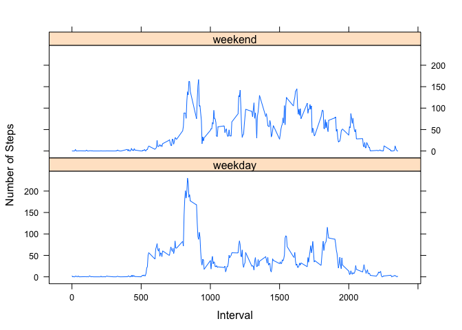

# Reproducible Research: Peer Assessment 1

The dataset used in this analysis (activity.zip, downloaded from [Activity monitoring data][1] ) was collected by an individual wearing a personal activity monitoring device. The dataset includes the number of steps taken in 5 minute intervals each day during October and November of 2012.

##Loading and Preprocessing the Data  
The dataset was first unzipped and loaded using the following commands: 


```r
#datafile<-"activity.zip"
#unzip(datafile) #this produces the activity.csv file
df<-read.csv("activity.csv", stringsAsFactors=FALSE)
```

The dateframe was then coverted to dplyr:tbl_df and the class of the column date was changed from string to POSIXct:


```r
library(dplyr)
library(lubridate)
activity<-tbl_df(mutate(df, date=ymd(date)))
```

##What is mean total number of steps taken per day?  
**1. Calculate the total steps taken in a day and ignore the missing values**  
A new data table named `stepsByDay` was created by grouping the dataset by date then and summing up the steps taken on each day with the following commands:

```r
stepsByDay<-activity %>% group_by(date) %>% summarize(total_steps=sum(steps, na.rm=TRUE))
```

**2. The steps taken on each day are visualized with a histogram**


```r
hist(stepsByDay$total_steps, main="Histogram of steps taken per day", xlab="Number of Steps")
```

 

Note that according to the assignment rubric, the missing values are to be ignored. The proper way of *ignoring* the missing value is to eliminate the days with missing values. For example, on October 1, 2012, all the intervals have the steps as 'NA'. Then October 1, 2012 should not be included in the analysis. One way is to use the filter function as follows:


```r
stepsByDay<-activity %>% filter(!is.na(steps)) %>% group_by(date) %>% summarize(total_steps=sum(steps))
```
Using the option `na.rm=TRUE` instead of `filter`, will include October 1, 2012 in the analysis with total steps as zero and bias the mean and median results. However, this is helpful when answering question 4 of the imputing missing values section.

**3. The mean and median of the total number of steps taken per day**  

```r
sprintf("The mean of the total number of steps taken per day is %d steps", round(mean(stepsByDay$total_steps)))
```

```
## [1] "The mean of the total number of steps taken per day is 9354 steps"
```

```r
sprintf("The median of the total number of steps taken per day is %d steps", median(stepsByDay$total_steps))
```

```
## [1] "The median of the total number of steps taken per day is 10395 steps"
```

## What is the average daily activity pattern?  
The number of steps taken for each of the 5-minute interval, averaged across all days is computed by grouping the dataset by interval and taking average of the steps taken across the days with the following commands:
 

```r
stepsByInterval<-activity%>%group_by(interval)%>%summarize(average_steps=mean(steps, na.rm=TRUE))
```
Note that here, I didn't filter the data table first. It is fine since there is at least one non-NA value for each interval. 

**1. A time series plot shows the daily activity**:

```r
with(stepsByInterval, plot(interval, average_steps, type = "l", main="Daily Activity Pattern", xlab="Interval", ylab="Average Steps"))
```

 

**2. Find the 5-minute interval which contains the maximum number of steps, average across all the days in the dataset.**


```r
top_n(stepsByInterval,1, average_steps)
```

```
## Source: local data frame [1 x 2]
## 
##   interval average_steps
## 1      835      206.1698
```
As shown in the R ouptput, the maximum number of steps averaged across all days in the dataset, is 206 steps and it occurs at **interval 835**. 

## Imputing missing values  
**1. Calculate and report the total number of missing values in the dataset**  
The number of missing values in the dataset is **2304** as shown by the following command:

```r
sum(is.na(activity$steps))
```

```
## [1] 2304
```

**2. Fill in all of the missing values in the dataset.**  
The strategy used here is to replace NA with mean steps for that 5-minute interval.  

**3. Create a new dataset that is equal to the original dataset but with the missing data filled in.**  
The `imputed_activity` is a dataset with the missing data replaced by the mean steps for the corresponding interval.


```r
imputed_activity <- activity %>% 
        group_by(interval) %>% 
        mutate(new_steps= replace(steps, is.na(steps), round(mean(steps, na.rm=TRUE), 2)))
imputed_activity
```

```
## Source: local data frame [17,568 x 4]
## Groups: interval
## 
##    steps       date interval new_steps
## 1     NA 2012-10-01        0      1.72
## 2     NA 2012-10-01        5      0.34
## 3     NA 2012-10-01       10      0.13
## 4     NA 2012-10-01       15      0.15
## 5     NA 2012-10-01       20      0.08
## 6     NA 2012-10-01       25      2.09
## 7     NA 2012-10-01       30      0.53
## 8     NA 2012-10-01       35      0.87
## 9     NA 2012-10-01       40      0.00
## 10    NA 2012-10-01       45      1.47
## ..   ...        ...      ...       ...
```

**4. Re-calculate the total steps taken in each day using the imputed dataset and display the results in a histogram.** 

```r
imputed_stepsByDay<-imputed_activity %>% group_by(date) %>% summarise(total_steps=sum(new_steps))
hist(imputed_stepsByDay$total_steps, main="Histogram of teps taken per day (imputed)", xlab="Number of Steps")
```

 

```r
sprintf("The mean of the total number of steps taken per day is %5.0f steps", mean(imputed_stepsByDay$total_steps))
```

```
## [1] "The mean of the total number of steps taken per day is 10766 steps"
```

```r
sprintf("The median of the total number of steps taken per day is %5.0f steps", median(imputed_stepsByDay$total_steps))
```

```
## [1] "The median of the total number of steps taken per day is 10766 steps"
```

Imputing missing values increases both the medium and mean steps taken in each day. This is due to the fact that the days with all 'NA' as number of steps taken (like October 1, 2012) are not treated as zero steps in the analysis. It is also evident from the histogram that the number of days with 0-5000 steps taken decreases from 13 to 5, while the number of days with 10,000-15,000 steps increases from 28 to 36.  

## Are there differences in activity patterns between weekdays and weekends?

**1. Create a new factor variable in the imputed dataset with two levels indicating whether a given date is a weekday or weekend. **  
The dataset `category_imputed_activity` is the dataset with missing values filled in and labeled by weekday or weekend  


```r
category_imputed_activity<-imputed_activity %>% mutate(category=ifelse(grepl("Sat|Sun",wday(date, label=TRUE)), 'weekend', 'weekday'))
category_imputed_activity
```

```
## Source: local data frame [17,568 x 5]
## Groups: interval
## 
##    steps       date interval new_steps category
## 1     NA 2012-10-01        0      1.72  weekday
## 2     NA 2012-10-01        5      0.34  weekday
## 3     NA 2012-10-01       10      0.13  weekday
## 4     NA 2012-10-01       15      0.15  weekday
## 5     NA 2012-10-01       20      0.08  weekday
## 6     NA 2012-10-01       25      2.09  weekday
## 7     NA 2012-10-01       30      0.53  weekday
## 8     NA 2012-10-01       35      0.87  weekday
## 9     NA 2012-10-01       40      0.00  weekday
## 10    NA 2012-10-01       45      1.47  weekday
## ..   ...        ...      ...       ...      ...
```

**2. Make a panel plot containing a time series plot of the 5-minute interval  and the average number of steps taken, averaged across all weekday days or weekend days. **  
The panel plot was created using the lattice package. From the plot, we can see that the individual is more active in weekdays than in weekends during the early part of the day. In contrast, he/she is more active in weekends than in weekdays during the later part of the day.  


```r
stepsyByIntevalWkdy<-category_imputed_activity %>% group_by(category,interval) %>% summarize(average_step=mean(new_steps))
library(lattice)
xyplot(average_step ~ interval |category, data=stepsyByIntevalWkdy, type="l", layout=c(1,2), xlab="Interval", ylab="Number of Steps")
```

 


[1]: https://d396qusza40orc.cloudfront.net/repdata%2Fdata%2Factivity.zip
